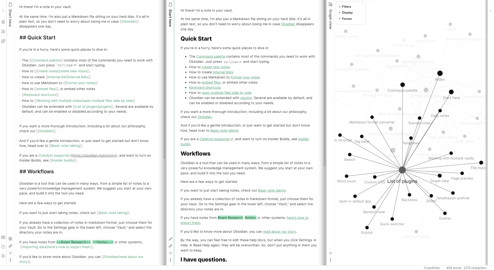
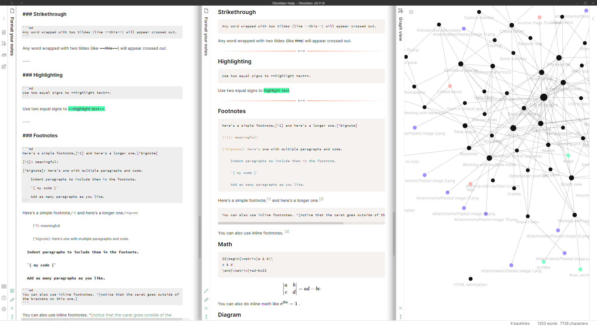
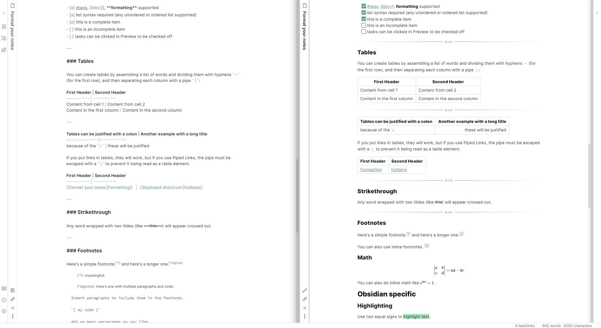

# Molecule
The Molecule theme for Obsidian. Light mode only

# Screenshots

## Installation
1. Download the `obsidian.css` file and put into your vault
2. In Obsidian, make sure Custom CSS is turned on (Settings --> Plugins)

> You can also find the theme in the community themes section